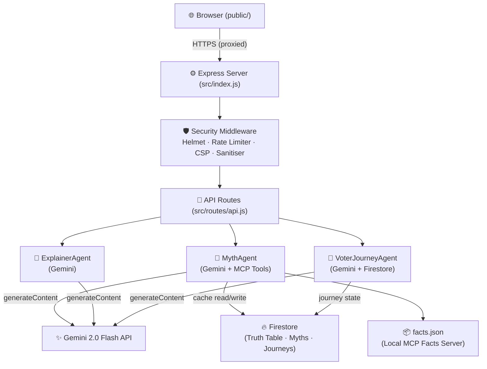

<div align="center">

# 🗳️ Chunav Saathi
### India's AI-Powered Civic Tech & Election Intelligence Platform

[](https://github.com/yourusername/chunav-saathi/actions/workflows/main.yml)
[](https://nodejs.org/)
[](LICENSE)
[](https://aistudio.google.com/)
[](https://firebase.google.com/)
[](https://cloud.run)
[](https://helmetjs.github.io/)

*Empowering every Indian voter with AI, real-time data, and civic education.*

[Live Demo](#) · [Report Bug](#) · [Request Feature](#)

</div>

---

## 📖 Table of Contents

- [About](#-about)
- [Features](#-features)
- [Tech Stack](#-tech-stack)
- [Architecture](#-architecture)
- [Security](#-security--key-protection)
- [Getting Started](#-getting-started)
- [API Reference](#-api-reference)
- [Testing](#-testing)
- [CI/CD](#-cicd-pipeline)
- [Deployment](#-deployment)
- [Project Structure](#-project-structure)

---

## 🌟 About

**Chunav Saathi** ("Election Companion") is a full-stack civic tech platform built to bridge the gap between India's Election Commission data and the everyday voter. It combines a glassmorphic React-inspired frontend with a hardened Node.js/Express backend powered by **Google Gemini 2.0 Flash** AI.

---

## ✨ Features

| Feature | Description |
|:---|:---|
| **🤖 AI Myth Buster** | Debunks election misinformation in real-time using Gemini 2.0 Flash with Firestore caching |
| **🧠 AI Explainer** | Translates electoral jargon (VVPAT, NOTA, Model Code) into simple Hinglish/Hindi/English |
| **🗺️ Voter Heatmap** | Color-coded crowd density map across Indian states with booth intelligence |
| **⏰ Election Time Machine** | Interactive timeline scrubber from 1952→2024 with side-by-side comparison view |
| **📊 Live Dashboard** | Real-time turnout charts, demographic splits, and hourly voting data via Chart.js |
| **🎮 3D EVM Simulator** | Fully interactive Electronic Voting Machine simulation |
| **🧭 Voter Journey** | AI-personalized 5-step civic education wizard tracked via Firestore |
| **📰 Verified News Feed** | ECI-sourced election news with myth-busting integration |

---

## 🛠️ Tech Stack

### Backend
| Layer | Technology |
|:---|:---|
| Runtime | Node.js 20 (LTS) |
| Framework | Express 4 |
| AI Engine | Google Gemini 2.0 Flash (`@google/generative-ai`) |
| Database | Firebase Firestore (`@google-cloud/firestore`) |
| Secret Management | Google Cloud Secret Manager |
| Security | Helmet.js, express-rate-limit, custom CSP, input sanitization |
| Compression | gzip via `compression` |

### Frontend
| Layer | Technology |
|:---|:---|
| Markup | HTML5 with semantic elements + WAI-ARIA |
| Styling | Tailwind CSS (CDN) + custom glassmorphism system |
| Charts | Chart.js 4 |
| Icons | Lucide Icons |
| Animations | CSS keyframes + Canvas Confetti |

### Infrastructure
| Layer | Technology |
|:---|:---|
| Container | Docker (multi-stage build) |
| Deployment | Google Cloud Run |
| CI/CD | GitHub Actions (5-stage pipeline) |
| Secrets | `.env` (dev) / GCP Secret Manager (prod) |

---

## 🏗️ Architecture



> **Key Principle:** The browser **never** contacts Google APIs directly. All Gemini and Firestore calls are server-side — keys are never exposed to the client.

---

## 🔐 Security & Key Protection

Security is **first-class** in this project, not an afterthought.

### Zero Key Exposure
- All API keys live in `.env` (excluded by `.gitignore`) or GCP Secret Manager in production
- The frontend (`/public`) contains **zero** secret values — only proxied `/api` calls
- CI pipeline runs `git grep` to detect accidental key commits
- CI pipeline runs TruffleHog secret scanning on every push

### HTTP Security Headers (Helmet.js)
```
Content-Security-Policy:  strict allowlist — no wildcard sources
Strict-Transport-Security: max-age=31536000; includeSubDomains; preload
X-Frame-Options:           DENY
X-Content-Type-Options:    nosniff
Referrer-Policy:           strict-origin-when-cross-origin
Permissions-Policy:        geolocation=(), microphone=(), camera=()
```

### Rate Limiting
| Scope | Limit |
|:---|:---|
| Global API | 100 req / 15 min / IP |
| AI endpoints (`/myth-check`, `/explain`) | 10 req / min / IP |
| Data endpoints (`/facts`, `/myths`) | 30 req / min / IP |

### Input Hardening
- All request bodies capped at **50 KB**
- `userId` validated against strict regex `^[\w-]{3,64}$`
- `text` fields capped at 2000 chars, `topic` at 500 chars
- HTML/script injection patterns stripped from all inputs
- Stack traces **never** returned in production responses

---

## 🚀 Getting Started

### Prerequisites
- Node.js ≥ 18
- A [Google Gemini API key](https://aistudio.google.com/app/apikey)

### Installation

```bash
# 1. Clone
git clone https://github.com/yourusername/chunav-saathi.git
cd chunav-saathi

# 2. Install dependencies
npm install

# 3. Configure secrets
cp .env.example .env
# Edit .env and add your GEMINI_API_KEY

# 4. Verify key is working
node check-key.js

# 5. Start dev server
npm run dev
```

Server starts at `http://localhost:3000`.

### Environment Variables

| Variable | Required | Description |
|:---|:---:|:---|
| `GEMINI_API_KEY` | ✅ | Google AI Studio API key |
| `GCLOUD_PROJECT` | prod | GCP project ID for Firestore |
| `FIRESTORE_EMULATOR_HOST` | dev | `localhost:8080` for local emulator |
| `GOOGLE_APPLICATION_CREDENTIALS` | local staging | Path to service account JSON |
| `CORS_ORIGIN` | prod | Comma-separated allowed origins |
| `NODE_ENV` | optional | `production` hides error stacks |
| `PORT` | optional | Default: `3000` |

---

## 📡 API Reference

All endpoints are under `/api/v1/`. Rate limits apply per IP.

### AI Endpoints (10 req/min)

#### `POST /api/v1/myth-check`
Fact-checks an election claim using Gemini + Firestore cache.

```json
// Request
{ "text": "EVMs can be hacked via Bluetooth", "lang": "hinglish" }

// Response
{
  "isMythBusted": true,
  "explanation_hi": "यह गलत है। EVMs standalone हैं...",
  "explanation_en": "This is false. EVMs are air-gapped...",
  "truthScore": 5,
  "sources": [{ "title": "ECI VVPAT Guidelines", "url": "https://eci.gov.in/vvpat", "credibility": 99 }],
  "category": "evm_security"
}
```

#### `POST /api/v1/explain`
Explains a civic topic at adjustable complexity.

```json
// Request
{ "topic": "VVPAT", "complexity": 2, "lang": "en" }
```

#### `POST /api/v1/explain/batch`
Batch-explains up to 5 topics in parallel.

```json
// Request
{ "topics": ["EVM", "NOTA", "VVPAT"], "lang": "hinglish" }
```

### Data Endpoints (30 req/min)

| Method | Path | Description |
|:---|:---|:---|
| `GET` | `/api/v1/facts?category=evm_security` | Curated election facts |
| `GET` | `/api/v1/facts?search=vvpat` | Full-text search facts |
| `GET` | `/api/v1/myths?category=voting_process&limit=20` | Verified myths from Firestore |
| `GET` | `/api/v1/explainer/capabilities` | Agent capabilities metadata |
| `GET` | `/api/v1/voter-journey/:userId` | Get/create voter journey |
| `PUT` | `/api/v1/voter-journey/:userId` | Update journey progress |
| `POST` | `/api/v1/voter-journey/:userId/complete` | Mark module complete |
| `POST` | `/api/v1/voter-journey/:userId/next-module` | AI-personalised next step |

### System

| Method | Path | Description |
|:---|:---|:---|
| `GET` | `/health` | Health check (Firestore + Gemini status) |

---

## 🧪 Testing

```bash
# Run all tests
npm test

# Unit tests only (no emulator needed)
npm run test:unit

# Integration tests (requires Firestore emulator)
npm run emulator   # in one terminal
npm run test:integration   # in another

# CI-style output with spec reporter
npm run test:ci
```

### Test Coverage

| Suite | Tests | Coverage Area |
|:---|:---:|:---|
| `mythAgent.test.js` | 17 | MythAgent core, cache, retry, MCP tools, safety |
| `api.test.js` | Integration | HTTP routes, validation, error handling |

---

## ⚙️ CI/CD Pipeline

5-stage GitHub Actions pipeline runs on every push to `main`:

```
Security Audit → Code Quality → Unit Tests → Integration Tests → Build Validation
```

| Stage | What it checks |
|:---|:---|
| **Security** | `npm audit`, TruffleHog secret scan, hardcoded key grep |
| **Quality** | Syntax check all JS files, repo size, `.env` not committed |
| **Unit Tests** | All 17 MythAgent tests with spec reporter |
| **Integration** | HTTP route tests against live Firestore emulator |
| **Build** | Production `npm ci --omit=dev`, server smoke test |

---

## ☁️ Deployment

### Google Cloud Run (Recommended)

```bash
# Build & deploy
gcloud run deploy chunav-saathi \
  --source . \
  --region asia-south1 \
  --allow-unauthenticated \
  --set-env-vars="NODE_ENV=production,GCLOUD_PROJECT=your-project-id"

# Set secret via Secret Manager (never as plain env var in prod)
gcloud run services update chunav-saathi \
  --update-secrets="GEMINI_API_KEY=gemini-api-key:latest"
```

### App Engine Flexible

```bash
gcloud app deploy app.yaml
```

---

## 📂 Project Structure

```
chunav-saathi/
├── .github/
│   └── workflows/
│       └── main.yml          # 5-stage CI/CD pipeline
├── public/                   # Static frontend (no secrets here)
│   ├── index.html            # Main app — glassmorphism dashboard
│   └── journey.html          # 5-step voter education wizard
├── src/
│   ├── index.js              # Express server (security-hardened entry point)
│   ├── middleware/
│   │   └── security.js       # Helmet, rate limiters, sanitiser, CSP
│   ├── routes/
│   │   └── api.js            # All API route handlers
│   ├── agents/
│   │   ├── MythAgent.js      # Gemini myth-busting + MCP tool dispatch
│   │   ├── ExplainerAgent.js # Multilingual civic topic explainer
│   │   └── VoterJourneyAgent.js # AI-personalized learning path
│   ├── services/
│   │   └── firestore.js      # Firestore service with LRU cache
│   ├── mcp/
│   │   └── factsServer.js    # Local facts DB + Gemini tool declarations
│   └── utils/
│       └── geminiClient.js   # Shared Gemini client with TTL cache
├── tests/
│   ├── agents/
│   │   └── mythAgent.test.js # 17 unit tests (100% passing)
│   ├── integration/
│   │   └── api.test.js       # HTTP integration tests
│   └── utils/
│       ├── mockData.js        # Canonical test fixtures
│       └── testHelpers.js     # Server lifecycle + HTTP helpers
├── data/
│   └── facts.json            # Curated election facts database
├── scripts/
│   └── check-size.js         # Repo size budget enforcer
├── .env.example              # All variables documented — no real values
├── .gitignore                # Comprehensive secret file exclusions
├── check-key.js              # Safe API key diagnostic (masked output)
├── Dockerfile                # Production container
├── app.yaml                  # App Engine Flexible config
├── cloudbuild.yaml           # Cloud Build pipeline
└── package.json              # Dependencies + npm scripts
```

---

## 📜 License

MIT License — see [LICENSE](LICENSE) for details.

<div align="center">
<br>
Built with ❤️ for Indian Democracy.
<br>
<sub>Powered by Google Gemini AI · Firebase · Cloud Run</sub>
</div>
